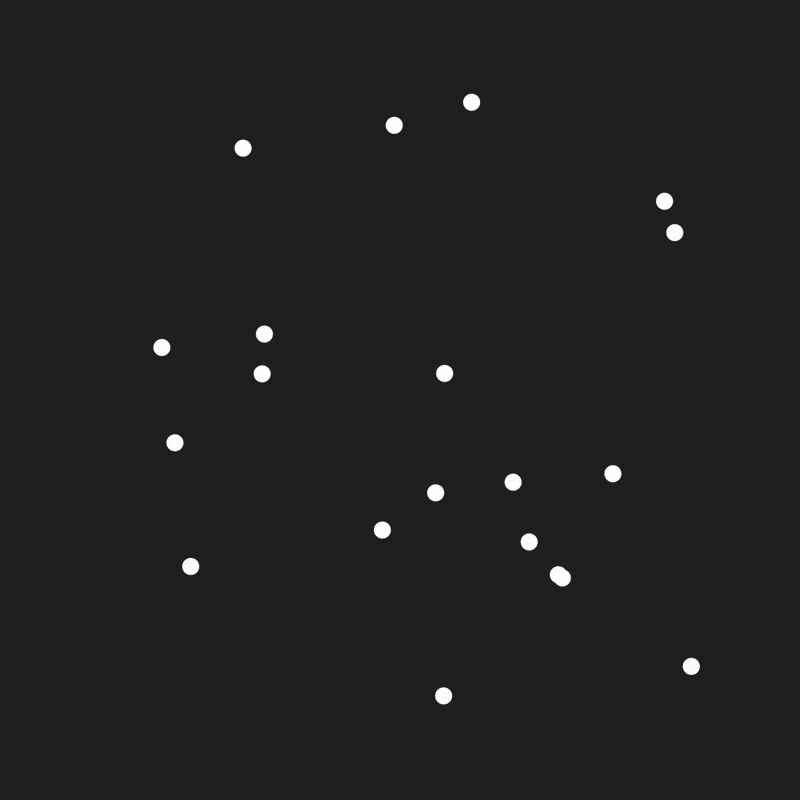

# Manim-VoronoiCells

A simple class that generates a voronoi diagram (voronoi tessellation) around given points. (Growing from Circles no implemented). For more detailed documentation see the source code.

<div align="center">
    
</div>

## Features:
 - Control over the bounding box of the diagram.
 - Polygon colors stay consistend during animation

## Dependencies:
 - manim (Community Edition)
 - shapely
 - geovoronoi

 ## Example:
 ```
class VoronoiDiagram(Scene):
    def construct(self):

        amount = 20
        coords = np.random.rand(amount,2)

        scale = np.array([[config.frame_width, config.frame_height]] * amount)
        offset = scale/2
        
        coords = 0.75* (coords*scale - offset)
        
        coords_3d = np.column_stack([
            coords[::,0], coords[::,1], np.zeros(amount)
        ])

        points = VGroup(*[Dot(coord) for coord in coords_3d])

        vor = VornoiCells(points)

        self.add(vor, points)
 ```

 ```
 class VoronoiDiagramAxes(Scene):
    def construct(self):

        amount = 10
        coords = np.random.rand(amount,2)

        scale = np.array([[4, 4]] * amount)
        offset = scale/2
        
        coords = 0.75 * (coords*scale - offset)
        
        axes = Axes(x_range=[-2,2], y_range=[-2,2], x_length=5, y_length=5)

        points = VGroup(*[Dot(axes.c2p(*coord)) for coord in coords])

        vor = VornoiCells.to_axes(points, axes)
        vor.set_opacity(0.5)

        self.add(vor, axes, points)

 ```


 ## Youtube Channels:
  - ## [tamaschque](https://www.youtube.com/@tamaschque) (Main)
  - ## [tama](https://www.youtube.com/@tamasque) (Second)